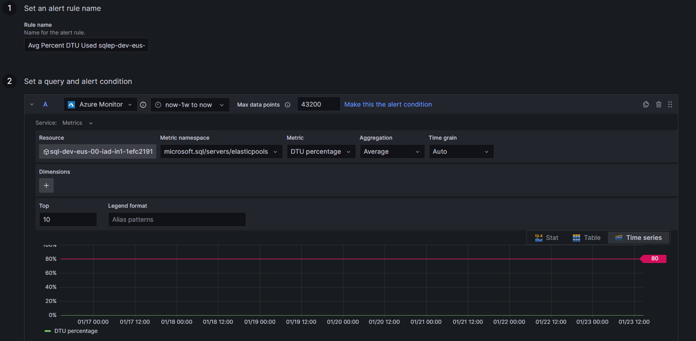
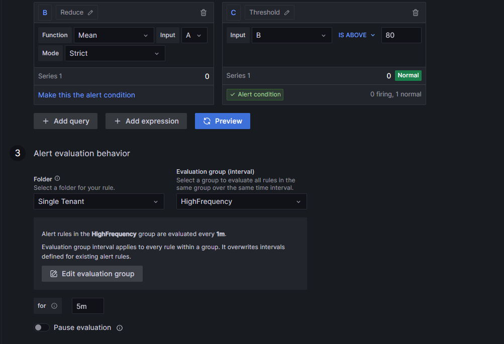
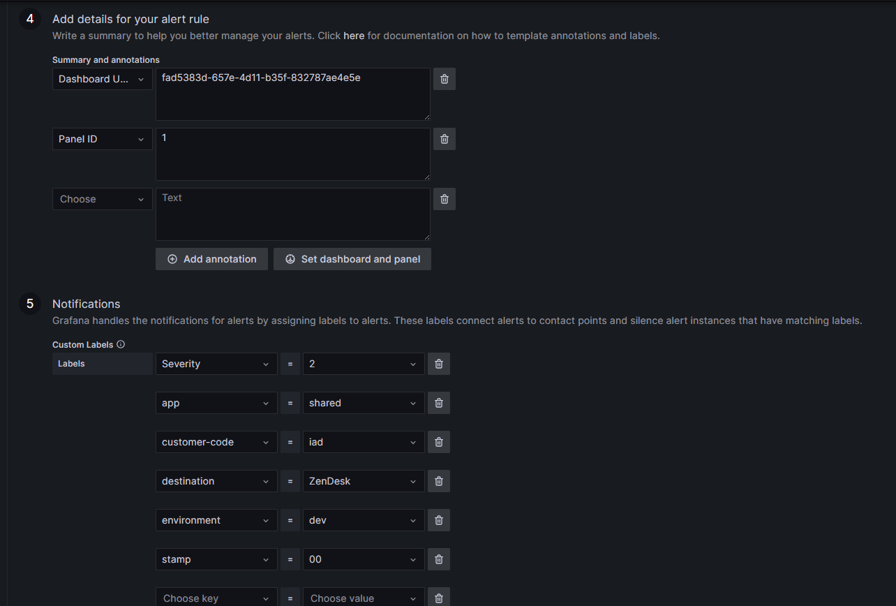

# Alerting Overview

There are two types of alerts to monitor our systems:

  1. In Azure Monitor. This is the preferred method for monitoring Azure resources, but currently has severe limitations when it comes to building complex alerts. Use this method when you need to monitor for a single Azure metric exceeding a threshold.
  1. In Grafana. This can be used to build very complex alerts that involve multiple time series or involves any type of data transformations or calculations.

 The Azure Monitoring team is working to expand the capabilities of Azure Monitor to make it more useful for our needs. When that happens, we will likely move all of our alerting to Azure Monitor.

 The easiest way to get started in creating an alert is to use either the Azure Portal or the Grafana Portal. The following sections will walk you through how to create an alert in each of these tools. This doc does not take the place of external documentaton. It is only here for a quick reference for the simplest of cases.

## How to create a basic alert in Grafana

1. Log in to the dev Grafana instance: https://grafana-dev-eus-cwazajhmdzhrhbdt.eus2.grafana.azure.com/d/Gmcf6rOnk/home?orgId=1
1. Click the 'hamburger' icon in the top left
1. Select Alerting
1. Select Alert Rules
1. Click '+ Create alert rule'
1. Give the rule a name
1. Choose your datasource (Typically Azure Monitor)
1. Verify the Service is 'Metrics'
1. Select your resource/metric namespace/Metric/Aggregation
1. If the metric requires/has dimensions choose them appropriately
1. Click the 'Preview' button to verify that that time series data exists
1. Select the Reduce operator appropriate for the alert (usually Mean)
1. Select a Threshold appropriate for the data
1. Under Alert Behavior, choose an appropriate folder and evaluation group
1. Select an appropriate duration. The time series data needs to violate the threshold for this amount of time before an alert will be generated
1. Add an appropriate Summary and Description
1. Under Customer Labels, add the following:
    1. destination = Zendesk
    1. severity = 2
    1. app =
    1. customer-code =
    1. environment =
    1. stamp =

### Example







## How to create a basic alert in Azure Monitor

Note that because all resources in Azure are deployed via Pulumi, the alerts are also deployed via Pulumi. This means that you should not create alerts manually in the Azure Portal. Doing so will result in the alert being deleted the next time the Pulumi stack is updated.
This guide is only here for reference. You should not need to create alerts manually in the Azure Portal, but you can use the Portal experience to help guide your settings in the Pulumi code.

1. Log in to the Azure Portal
1. Go to the resource you want to monitor
1. Click on the Alerts tab
1. Click 'Create'
1. Select the Signal you want to monitor
1. Select the Alert logic and whether or not you want to split by dimensions and how often you want to evaluate the alert
1. Click next
1. Select the Action Group you want to use
1. Click next
1. Set the Alert rule details

## How to extract rules from Grafana to your local machine

1. Clone the AzurePlatform repository
1. Navigate to the `grafana` directory
1. Run the following command to extract the rules from Grafana to your local machine:

```powershell
.\alerts\ImportAlerts.ps1 -subscription dev -resourceGroup "rg-dev" -grafanaUrl "https://grafana-dev-eus-cwazajhmdzhrhbdt.eus2.grafana.azure.com" -grafanaName "grafana-dev-eus"
```

1. The script will prompt you to log in to Grafana. Once you have logged in, the script will extract all of the rules and save them to the `Alerts\AlertRules` directory.
1. Note that this can be a very large number of files created, but you can ignore any files you don't need.

## How to create an alert template from the imported rules

1. Find the file you want to use as a template
1. Copy the file to the `Alerts\AlertTemplates` directory and name it appropriately. For each field that needs to be replaced in the template, set the value to "ReplaceMe". This makes it easier to spot fields in the generated alerts later that were not properly replaced.
1. In the `Alerts\AlertManifests` directory, copy one of the existing manifest files and name it appropriately. If this alert is "generic" alert put the file in the `Generic` directory. A generic alert has a single metrics query, a single reduction expression, and a single threshold. Most times, these alerts should be created in Azure Monitor, but there are cases where some of these alerts may be created in Grafana.
1. In the new manifest file, update the properties as appropriate.
1. If the alert is a generic alert, there is nothing else you need to do.
1. If the alert is not generic, create a copy of one of the powershell scripts in the `Alerts` directory and name it appropriately. Update the script to use the new manifest file and the new template file.
1. Update the powershell script to update the template as needed.
1. Run the script.
1. Validate that the new alert files are created in the `Alerts\AlertRules` directory in a sub folder with the same name as the manifest file. Validate that all the fields are correct in the new alert files.

## How to update all alerts in Grafana

Once you have completed the steps above, you can run the following command to update all of the alerts in Grafana:

```powershell
.\DeployGrafanaAlerting.ps1 -subscription dev -resourceGroup "rg-dev" -grafanaUrl "https://grafana-dev-eus-cwazajhmdzhrhbdt.eus2.grafana.azure.com" -grafanaName "grafana-dev-eus"
```

After the files have been uploaded successfully, you can go to the Grafana portal and verify that the alerts have been created.

## How to Add a New Alert to the Pulumi Code

1. Clone the https://github.com/WillowInc/Infrastructure-and-Application-Deployment repository
1. Find the appropriate Pulumi stack for the alert you want to add
1. Add a New Metric Alert to the stack. (Look for existing MetricAlerts in existing code for how to do this)
1. Deploy the stack to all customer environments

## Troubleshooting Guides

Each alert should have a trouble shooting guide created here: https://willow.atlassian.net/wiki/spaces/PE/pages/2509766669/CTS+-+Troubleshooting+Guides.
If you are creating a new alert, you need to consider what needs to be done to resolve the issue if the alert is thrown. At the bare minimum the alert should inform the CTS team of who to contact should the alert ever fire.
