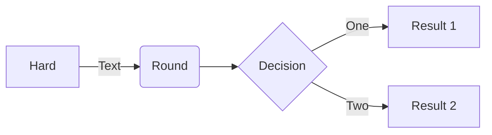

# MkDocs

A fork of https://pypi.org/project/mkdocs-with-confluence/ is used to convert MkDocs sites to confluence pages. This allows content to be stored in git and generate confluence and Techdocs (Backstage doc files) from the same source.


## Diagrams

Kroki support is available to render a wide variety of diagrams as code https://kroki.io/#support. Diagrams can be added to docs files via code fences

This is a sample diagram with a `mermaid` code fence

```
flowchart LR

A[Hard] -->|Text| B(Round)
B --> C{Decision}
C -->|One| D[Result 1]
C -->|Two| E[Result 2]
```




## Configuration

Configuration follows standard [MkDocs configuration](https://www.mkdocs.org/user-guide/configuration/), credentials for the mkdocs-with-confluence plugin are provided by two environment variables `JIRA_USERNAME` and `JIRA_PASSWORD` additionally the environment variable in the following example config `MKDOCS_TO_CONFLUENCE` is used to enable/disable mkdocs generation this allows just the techdocs site to be generated if needed.


## Build

Building is done via CI pipelines, this can be when the main product changes or only when docs change. Build pipelines can be run on Github or Azure DevOps pipelines.

Templates for azure devops can be found in https://github.com/WillowInc/AzurePlatform/blob/main/build-templates/build-docs.yaml and used from any Willow Project as a seperate stage

```yaml
resources:
  repositories:
    - repository: templates
      type: git
      name: AzurePlatform/AzurePlatform

stage:
  //...
  - template: build-templates/build-docs.yaml@templates
    parameters:
      docsDirectory: $(Build.SourcesDirectory)/Grafana
      backstageEntity: default/component/grafana
```


Github can use a reusable workflow from any org repository

```yaml
name: Docs for BackstageApp

on:
  push:
    branches: [main]
    paths:
      - 'BackstageApp/docs/**'
      - 'BackstageApp/mkdocs.yml'
jobs:
  build:
    uses: WillowInc/AzurePlatform/.github/workflows/reusable-workflow-docs-build.yml@main
    secrets:
      jira_password: ${{ secrets.JIRA_PASSWORD }}
      client_secret: ${{ secrets.CLIENT_SECRET }}
      client_id: ${{ secrets.CLIENT_ID }}
      jira_username: ${{ secrets.JIRA_USERNAME }}
    with:
      docs_path: BackstageApp
      backstage_entity_name: 'default/component/backstageapp'


```
