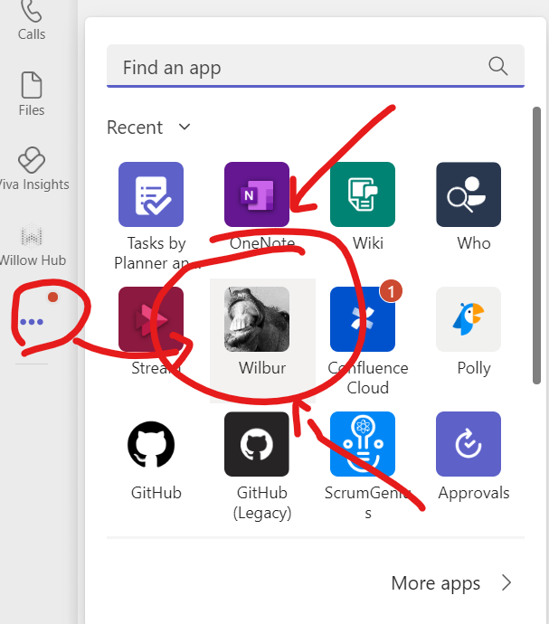
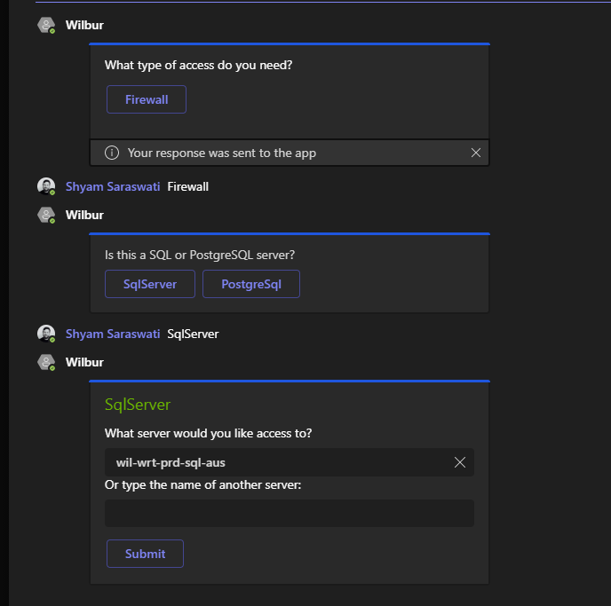

Wilbur is a Microsoft teams bot that provides “ChatOps” functionality for our people.

Currently supported

- Database firewall access requests
    - MS SQL
    - PostgreSQL
- Automated clean up added firewall rules

Wilbur should be automatically installed as an app in Teams. You can verify this by looking in the Teams app listing

You can also check by simply starting a chat thread with Wilbur

