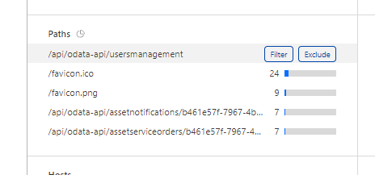
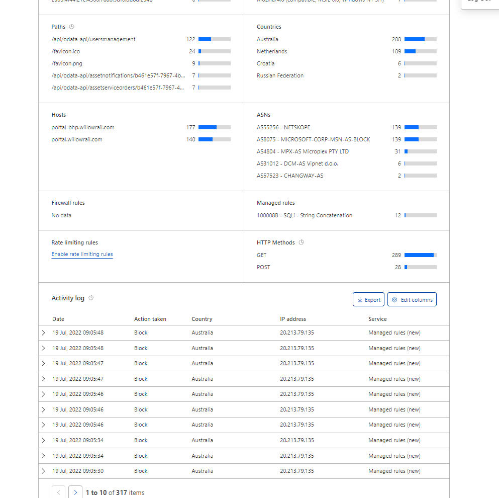
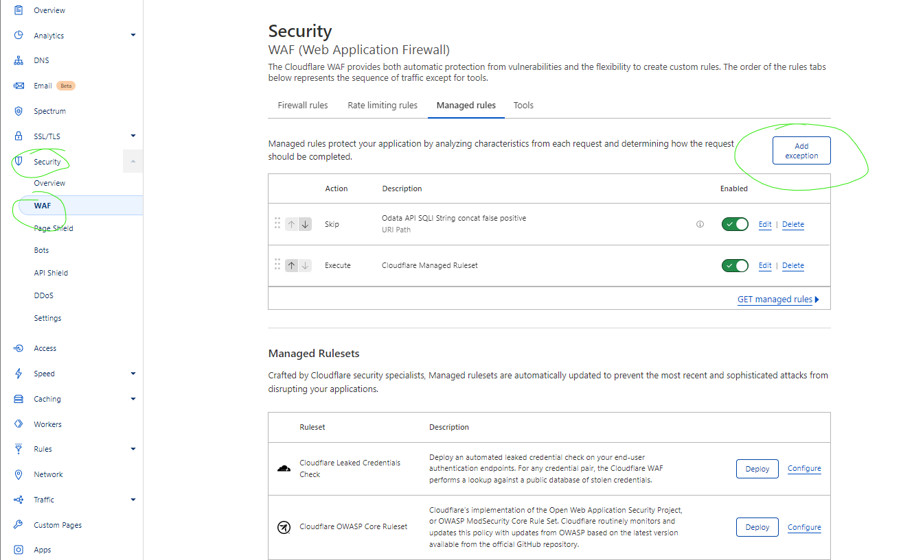
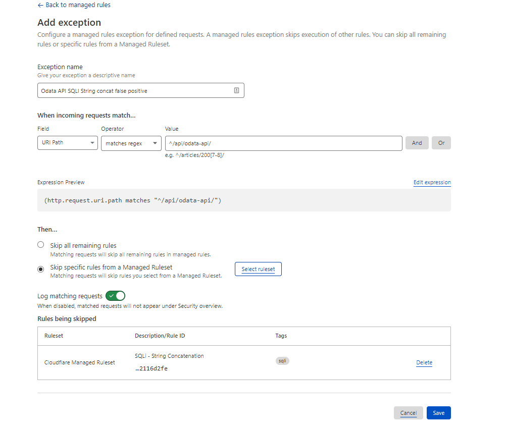

# Copy of Diagnosing Cloudflare WAF blocks

# Overview

Should you have issues with Cloudflare blocking network access, this
troubleshooting guide may be helpful.

Cloudflare logs are currently only available from the Cloudflare
Dashboard. App sec and Platform team members are able to assist with
troubleshooting issues.

### Viewing current blocks/skips

From the domains dashboard navigate to Security \> Overview to view logs
and details of WAF rules. It is possible to filter in/out data by
selecting filter or exclude on an item.

This will allow you to drill down further and find matching requests in
the activity log.

## False Positives

Ideally, exclusions are avoided and requests are refactored to not
trigger WAF rules. Traffic that triggers the cloudflare WAF is also
likely to trigger customer security devices, Frontdoor/Gloo waf and
other security tools.

When a false positive can’t be refactored it's important to validate
that adding exclusions to the rule is not going to open potential attack
surfaces. This could be done by validating that the rule is not relevant
to specific traffic.

*Scenario 1: SQL Injection rule is triggered on endpoint. Validate if
SQL is used on that service, Validate if Injection is possible if it is
used. Fix injection issues before making exceptions. Add exception.*

Scenario 2: PHP rule is triggered. Validate that no services either
Willow owned or Supplier provided use SQL.

For scenario 1 we would try and exclude as narrow a set of paths as
possible as future development could develop new attack surfaces. For
scenario 2 it's unlikely we adopt PHP as a tool so we may consider
disabling the whole rule class. Consult with app sec for advice on rule
tuning and approval.

### Adding Exceptions

Exceptions can be added from the managed rules page. This will show all
other exceptions and they are executed from top to bottom. More specific
rules should be added earlier in the execution order.

 