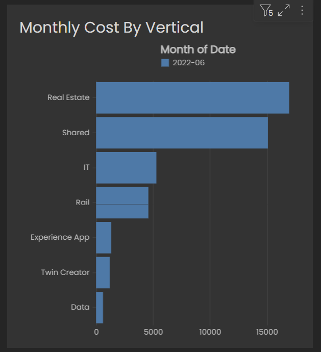
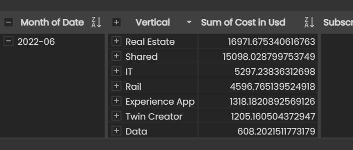
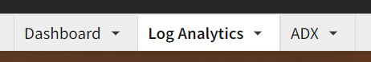
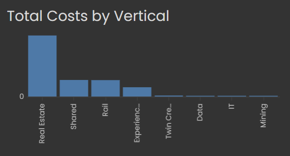
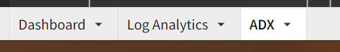
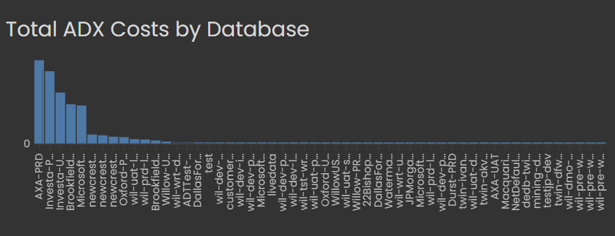
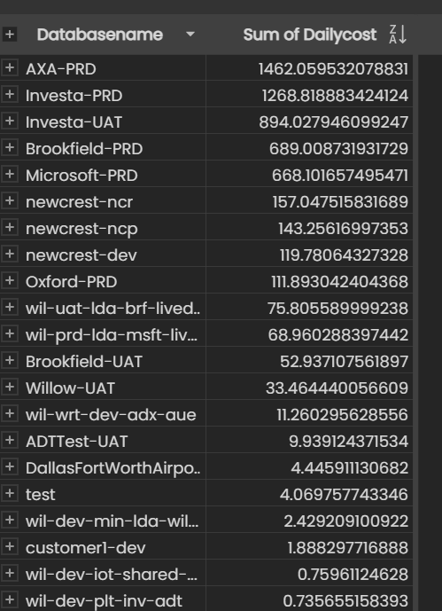

# Copy of Monthly Azure Cost Allocation Process

# Overview

Each month we get a single large Azure invoice. We need to allocate our
Azure costs to the different cost centres across the business.

These cost centres are:

- Real Estate

- Rail

- Experience

- Mining

- Data Science and Engineering

- Shared (i.e. no sector-specific allocation)

- IT

- Twin Creator (legacy product)

# Cost Allocation Process

## Gather initial costs by cost centre

Use the Azure Costs report in Sigma. <a
href="https://app.sigmacomputing.com/willow/workbook/Azure-Costs-7KBMx4Aaa3QhB9vRF4Tn88"
data-card-appearance="inline"
rel="nofollow">https://app.sigmacomputing.com/willow/workbook/Azure-Costs-7KBMx4Aaa3QhB9vRF4Tn88</a>

**IMPORTANT:** Check the date range in the Sigma report matches the
Azure billing period

Expand the `Costs by Vertical` panel to full size

Use the data grid to make it easier to see the totals for the period

## Allocate the Log Analytics Costs

We have a central Log Analytics service used by all verticals. We need
to ensure we separate out the costs by sector.

Navigate to the Log Analytics tab

Use the Total Costs by Vertical panel to see the specific costs by
sector.

For each sector, remove the cost from the Shared cost centre and add it
to the appropriate cost centre instead.

## Reallocate ADX Costs

To reduce operational costs, we share ADX clusters across sectors. We
need to allocate out the compute, storage, and network costs for the ADX
cluster to each customer.

Navigate to the ADX tab

Expand the `ADX Costs by Database` panel

At this point, you’ll need to use a little knowledge as to which
customers are related to which sectors. _The customer lookup table in
Snowflake can help if you’re not sure._

Collapse the data panel to show totals by database name, and then
reallocate costs out of ‘Shared’ and into the appropriate cost centre
based on the customer name.

For database costs less than $1, it’s OK to just leave them as Shared
costs.

## Determine if any Data costs need Reallocation

The “Data” subscription is for the Data Science and Engineering team’s
use and most costs are not sector-specific costs.

However, there may be Azure Data Factory pipelines that are
sector-specific related to migration jobs or other one-off processes.
Should you see any significant costs for the month in that subscription
(above $500) you may need to contact the Data Engineering team to
understand the costs further.

## Reallocation of Kubernetes Costs

Cluster costs are not yet broken down by vertical or customer.

At this time, the Kubernetes costs should be allocated to Shared.

---

# Reference Notes

**Azure Subscriptions - primary cost centre allocation**

_Product: Platform_

- Platform-{PRD\|DEV\|UAT}

_Product: TwinCreator_

- Build-{PRD\|DEV\|UAT}

- Exclude any VisualStudio Pro monthly subscription costs. These
  should be in Product : Shared

_Product: WIllowRail_

- Rail-{DEMO\|PRD\|PRE\|UAT\|DEV}

_Product: Experience_

- Experience-{PRD\|UAT\|DEV}

_Product: Shared_

- Products-Shared

- SandboxShared

- K8S-Internal

- K8S-Internal-Resources (most costs will be reallocated)

- Data

_IT: Shared_

- Willow-CoreIT

- Willow-IT

- Sandbox-IT

- CyberSecurity

- \[Unnamed Subscription\]

  - Note: This is where reserved VM instances appear
