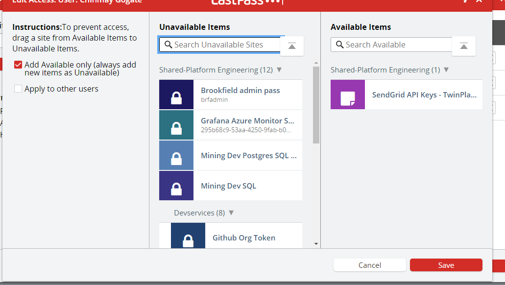

# Access Secrets in Lastpass

All secrets should be stored and shared via lastpass not teams or other
mechanisms.

### Shared Folder

Secrets for Platform Team services are stored within Lastpass in a
shared folder called **Platform Engineering** access to the folder is
granted by Existing Platform Engineering team members.

### Sharing to other people **Platform Engineering**

Individual items can be shared to other team members where access is
required. This can happen from the folder.

This is controlled from an individual users entry in the managed shared
folder option.

