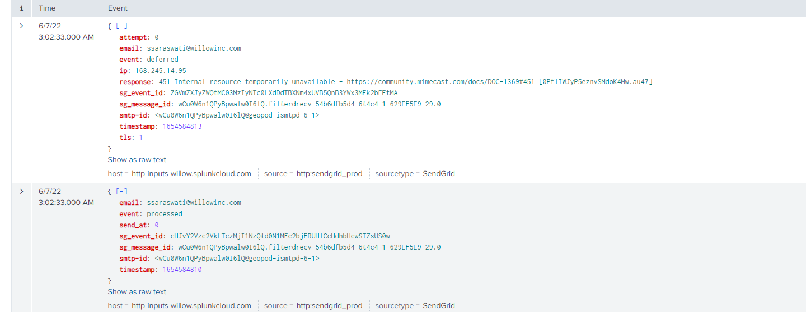

# Copy of Diagnosing Email Issues (SendGrid)

Logs for emails are stored in
<a href="https://willow.splunkcloud.com/en-US/app/search/search"
rel="nofollow">Splunk</a> and can be accessed without having access to
<a href="https://app.sendgrid.com/" rel="nofollow">sendgrid</a>.


## Example Query

``` csharp
index="platform_prod_sendgrid" | where email =  "ssaraswati@willowinc.com"
```

From these logs, you will be able to see if the email was being sent
from the app code at all.

If it's been able to be send to the customer or other related errors. If
no logs are in SendGrid start looking in app logs for other related
issues.



### Details In SendGrid

The email Activity Feed in SendGrid can have more details on messages
than the logs, this will include the API key used to send a message
which may be useful to trace back email sources. Access to SendGrid is
generally more restricted than Splunk, speak to a Security or Platform
team member for assistance.

